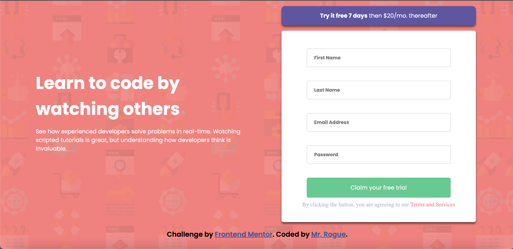
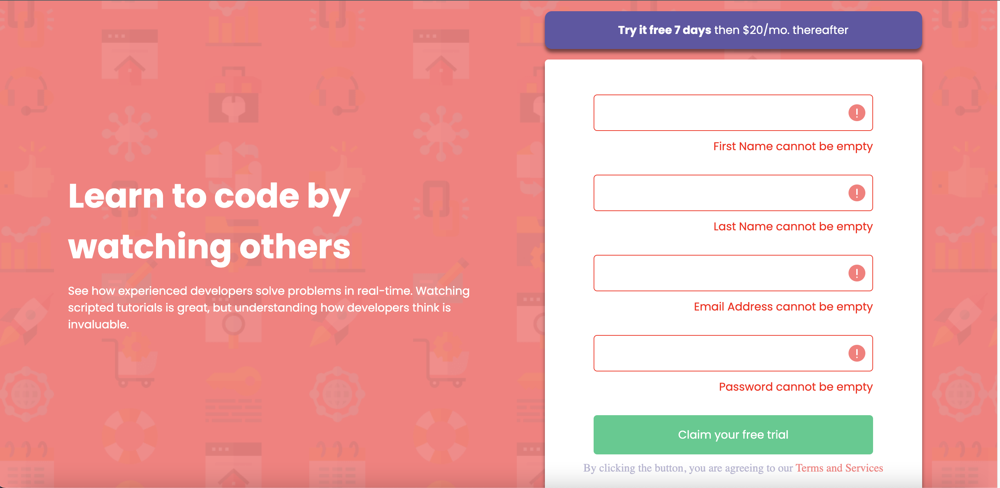
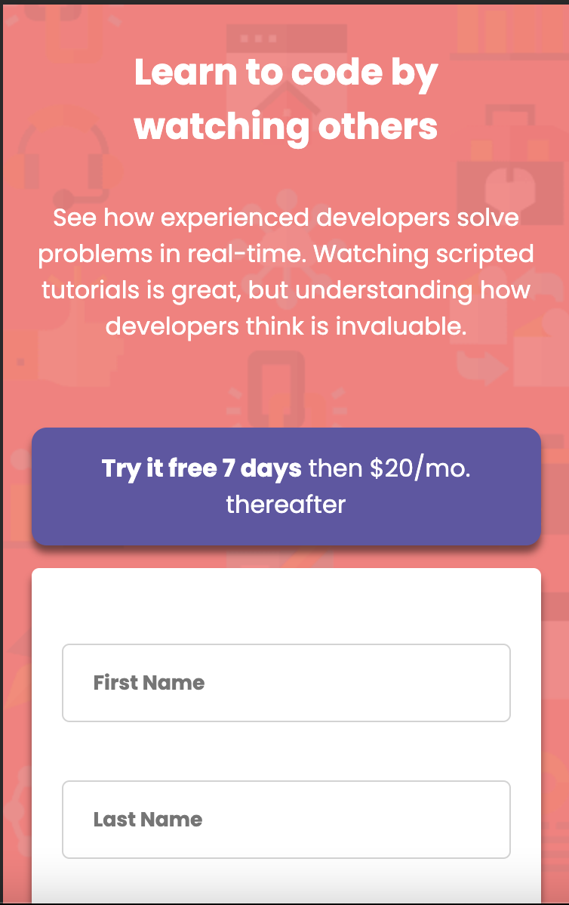

# Frontend Mentor - Intro component with sign up form solution

This is a solution to the [Intro component with sign up form challenge on Frontend Mentor](https://www.frontendmentor.io/challenges/intro-component-with-signup-form-5cf91bd49edda32581d28fd1). Frontend Mentor challenges help you improve your coding skills by building realistic projects.

## Table of contents

- [Overview](#overview)
  - [The challenge](#the-challenge)
  - [Screenshot](#screenshot)
  - [Links](#links)
- [My process](#my-process)
  - [Built with](#built-with)
  - [What I learned](#what-i-learned)
  - [Continued development](#continued-development)
  - [Useful resources](#useful-resources)
- [Author](#author)
- [Acknowledgments](#acknowledgments)

## Overview

### The challenge

Users should be able to:

- View the optimal layout for the site depending on their device's screen size
- See hover states for all interactive elements on the page
- Receive an error message when the `form` is submitted if:
  - Any `input` field is empty. The message for this error should say _"[Field Name] cannot be empty"_
  - The email address is not formatted correctly (i.e. a correct email address should have this structure: `name@host.tld`). The message for this error should say _"Looks like this is not an email"_

### Screenshot





### Links

- Solution URL: https://github.com/vernonroque/intro-signup-form.git
- Live Site URL: https://introduction-signup-form.netlify.app/

## My process

1. I first created the outline and structure in html.
   -I made sure to create the structure first. I then started doing the
   css styling to organize
2. Next, I started doing the CSS styling
   - I used flexbox to position the containers. I also used flexbox to organize
     the form header and the actual form
   - I designed the layout with a desktop screen in mind
3. I added functionality with javascript
   - I made sure the form would produce the errors if a user didn't fill in one of the
     inputs.
4. I styled the design in CSS for a mobile responsive design

### Built with

- Semantic HTML5 markup
- CSS custom properties
- Javascript
- Flexbox
- Desktop-first workflow

### What I learned

1. I learned its best not to use '100vh' when defining the height of a container.
   -The reason: It causes overflow problems. When the height is fixed, and the content
   needs to act responsively, the content sometimes spills out of the container and
   causes unexpected overflow problems. I think the only time ill define a height is
   for landing page images and the header at the top of a webpage

DONT DO:

```css
body {
  height: 100vh;
}
.main {
  height: 100vh;
}
```

2. I learned a lot about how to submit the form. There's two ways.
   - You can add a 'submit' event listener to the form, and then handle the data
     your liking
   - You can add a 'click' event listener to the button inside the form, and then
     handle the data to your liking

```js
form.addEventListener('submit',(e)=> {
  ...
}
or

submitButton.addEventListener('click', (e)=>{
  ...
})
```

3. I learned how to access the class attribute of a tag

- I need to access the class attribute from each input. I needed to do this
  for validating each field

```js
inputFields.forEach((input) => {
  const className = input.className;
});
```

4. I learned how to access any attribute of a tag element
   -I had to access the "name" attribute for each input field to display the
   error messages appropriately

```js
inputFields.forEach((input) => {
  const inputNameAttribute = input.getAttribute("name");
});
```

5. I learned how to show if there was an error with one of the input fields

- First I checked to see if the input field was empty

```js
if (className === "email") {
  if (!inputValue) {
    const targetInput = document.querySelector(`.${selector}`);
    targetInput.classList.add("error");

    errorEmailMessage.innerHTML = `
            <p>${attribute} cannot be empty</p>
            `;
  }
}
```

-If the field was empty, I added the class "error" to the input. That way I could
use CSS to style it so that it notifies the user there is an error

```css
.firstName.error,
.lastName.error,
.email.error,
.password.error {
  outline: none;
  border-color: red;
  background: url("./images/icon-error.svg");
  background-position: right 10px center;
  background-repeat: no-repeat;
}
```

6. I learned that "::placeholder" was a pseudo element
   -I used it to hide the placeholder value when an error occurred

```css
.firstName.error::placeholder,
.lastName.error::placeholder,
.email.error::placeholder,
.password.error::placeholder {
  visibility: hidden;
}
```

7. I learned the difference between the array methods .map and .forEach
   -.map() modifies each element based according to your liking and returns a new array
   -.forEach() is used to do some kind of function to each element in an array.
   However, it doesn't return an array.
   -I used forEach to add an eventListener to each input field

```js
inputFields.forEach((input) => {
  input.addEventListener("keypress", () => {
    const inputClass = input.className;
    resetErrors(inputClass);
  });
});
```

### Continued development

I still would like to focus on creating forms. I feel more comfortable now that
I've done this project. I'd still like to learn what I do with the values that were
input in the fields.

That's why I'm thinking about extending this project into a fullstack project.

I also would like to focus on easier ways to add event listeners to multiple items all
at once.

### Useful resources

- [Chat GPT](https://chat.openai.com/) - I used Chat GPT whenever I was stuck on some
  problem. I used it to help me explain what the problem was and how to fix it.
- [MDN Web Docs](https://developer.mozilla.org/en-US/) - I used this to help me explain
  certain array methods and other things about css i didnt understand

## Author

- Website - [Vernon Roque](https://developer-portfolio-8cc0c.web.app/)
- Frontend Mentor - [@vernonroque](https://www.frontendmentor.io/profile/vernonroque)
- Github - [@vernonroque](https://github.com/vernonroque)

## Acknowledgments

Thank you universe.
